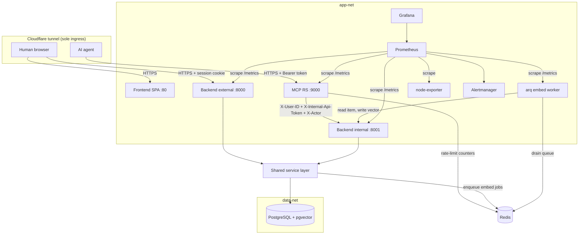

# Architecture

Floresu is a career tracker for two kinds of caller. Humans use a React SPA. AI agents use an MCP server. Both reach one backend, so the rules for the profile, worklog, library, resumes, and job applications live in one place.

This guide describes the system shape, the component roles, the trust zones, and the request flows. It documents the current implemented state and cites canonical source paths instead of copying code.

## System shape

The system is one backend that serves two apps, one MCP Resource Server, one React SPA, one embedding worker, one PostgreSQL database (with pgvector), one Redis instance, an observability tier, and one Cloudflare tunnel for ingress.

Canonical sources:

- App factory: `backend/src/floresu/core/app_factory.py`
- Per-app route registry: `backend/src/floresu/core/route_registry.py`
- External app entrypoint: `backend/src/floresu/api/`
- Internal app entrypoint: `backend/src/floresu/api_internal/`
- MCP RS assembly: `mcp/src/floresu_mcp/`
- Embedding worker: `worker/src/floresu_worker/`
- Container topology: `docker-compose.yml`

## Topology

Two Docker bridge networks separate the tiers. `app-net` carries every first-party service. `data-net` isolates PostgreSQL. Only the backend and the worker bridge both networks. Redis is dual-homed on both networks, so the MCP rate limiter reaches it on `app-net` without joining `data-net`, while PostgreSQL stays reachable on `data-net` alone. The tunnel is the only ingress and opens no inbound host port.

## Component roles

| Component | Role | Canonical source |
|-----------|------|------------------|
| External app (`:8000`) | Internet-facing. Authenticates humans by session cookie. Hosts the public REST API and the OAuth 2.1 authorization server. | `backend/src/floresu/api/` |
| Internal app (`:8001`) | app-net only. Trusts an injected `X-User-ID` behind `X-Internal-Api-Token`. Mounts the domain routers plus the embedding pipeline over the same service layer. Never mounts the web-only lifecycle routes. | `backend/src/floresu/api_internal/` |
| MCP Resource Server (`:9000`) | The agent front door. An OAuth 2.1 Resource Server that verifies the agent bearer token, then forwards each tool call to the internal app. Holds no backend domain code. | `mcp/src/floresu_mcp/` |
| Embedding worker | An arq worker that drains the embed queue on Redis and calls the internal app to read an item and write back its vector. Exposes metrics on `:9100`. | `worker/src/floresu_worker/` |
| Frontend SPA (`:80`) | The React app for humans. Talks to the external app over a typed REST client. Served by nginx in the container. | `frontend/` |
| PostgreSQL + pgvector | The single datastore. Reached by the backend over an async connection pool. The `vector` extension backs semantic search. | `docker-compose.yml` |
| Redis | The arq queue broker, the SSE feed pub/sub and replay buffer, and the MCP rate-limit counters. | `docker-compose.yml` |
| Observability | Prometheus scrapes `/metrics` on all apps and the worker in-network. node-exporter reports host metrics. Alertmanager routes alerts to Discord. Grafana is provisioned but never a release gate. | `docs/monitoring.md` |

Both apps come from `create_app` (`core/app_factory.py`). They differ only by injected settings and by which routers and identity dependency they mount.

## Isolation and trust zones

| Zone | Reachable from | Identity model | Must never |
|------|----------------|----------------|------------|
| External app (`:8000`) | Internet via the tunnel | Session cookie; strips any inbound `X-User-ID` app-wide | Trust a client-supplied `X-User-ID` |
| Internal app (`:8001`) | app-net only | Trusted `X-User-ID` behind `X-Internal-Api-Token`, plus a named `X-Actor` | Be tunnel-routed or host-published |
| MCP RS (`:9000`) | Internet via the tunnel | Agent Bearer token, audience-bound | Forward the agent token downstream, or serve any path but the PRM document and `/mcp` at ingress |
| Data tier | app-net (data-net) only | Connection pool credentials | Be reachable from the edge |

Every request resolves to exactly one `user_id`, and the server never trusts one from a request body or a tool argument. See `auth.md` for how each boundary resolves identity and fails safe.

## Design decisions

| Decision | Rationale |
|----------|-----------|
| One factory, two apps | The external and internal apps share one service layer and differ only by injected settings and the per-app route registry (which routes mount and the identity each resolves), so a rule is defined once. |
| Backend/MCP boundary | The two are separate deployable images. The MCP shares no backend domain code. The wire truths it shares (header names, the single OAuth scope, lean schemas) are re-declared and gated by `contract/tests/`, so a backend-internal change cannot silently mutate the agent contract. |
| Actor provenance | Every write carries an `Actor` (human, or a named agent) resolved at the boundary, so the audit log and the activity feed can show "you" versus a named agent. See `core/actor.py`. |
| Fail-safe deny at every boundary | An empty `SESSION_JWT_SECRET` denies all sessions; an empty `INTERNAL_API_TOKEN` denies all internal calls; a missing state seam degrades to deny. |
| 404 over 403 | The service returns 404 for a resource another account owns, so a caller never learns a resource exists but is off-limits. |
| Site-URL pinning | All OAuth issuer, metadata, and endpoint URLs build from pinned config, never from the request host, because the tunnel reaches the origin over an internal URL. |
| Document-plus-write-derived index | A resume's `document` JSONB is authoritative; scalar columns are write-derived, so reads stay cheap and the source of truth stays single. |
| Sync fast-path plus async worker | The internal (agent) app embeds a changed item inline so a same-turn search sees it; the external (web) app enqueues an arq job the worker drains. See `data-model.md`. |

## Request flows

The detailed sequence diagrams live with the domain that owns each flow:

- Human session request (cookie verify, `sid` blacklist lookup, strip middleware): see `auth.md`.
- Agent OAuth token acquisition (register, authorize, consent, token, refresh): see `auth.md`.
- Agent tool call (bearer verify, the RS-to-internal hop, confused-deputy defense): see `mcp.md`.

## Cross-references

- Trust boundaries and the OAuth model: `docs/auth.md`.
- Storage ownership and the domain lifecycles: `docs/data-model.md`.
- REST route catalog and the error contract: `docs/api.md`.
- MCP transport and the internal-hop contract: `docs/mcp.md`.
- Metrics, alerts, and retention: `docs/monitoring.md`.
- Frontend architecture, the theme layer, and the view conventions: `docs/frontend.md`.
- Look-and-feel rules and the contrast posture: `docs/design-language.md`.
- Local setup and workflows: `docs/development.md`.
