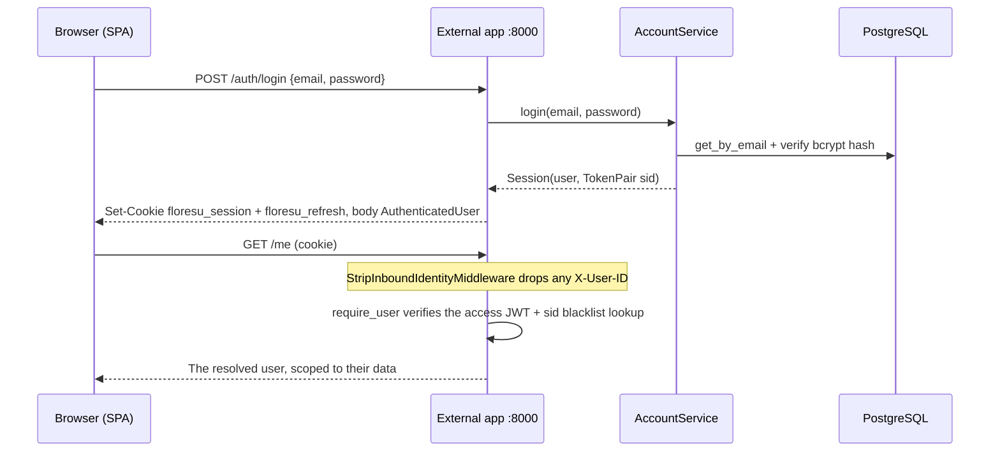
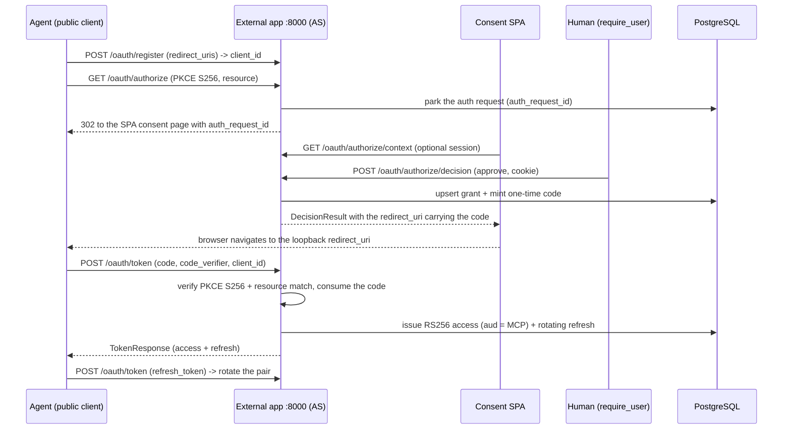

# Authentication and authorization

Floresu has two kinds of caller and two matching trust boundaries. Humans reach the external app with a session cookie. AI agents reach the MCP server with an OAuth 2.1 bearer token. This guide describes both models, the OAuth authorization server, the actor model, and the request flows.

This guide documents the current implemented state. It cites canonical source paths instead of copying code. For the REST route catalog and the error contract, see `api.md`.

Canonical sources:

- Identity boundaries and the strip middleware: `backend/src/floresu/core/identity.py`
- Actor descriptor and resolution: `backend/src/floresu/core/actor.py`
- Internal-boundary header names: `backend/src/floresu/core/headers.py`
- Human session model (verifier, codec, config, passwords): `backend/src/floresu/accounts/`
- OAuth authorization server: `backend/src/floresu/oauth/`
- MCP bearer boundary: `mcp/src/floresu_mcp/` (see `mcp.md`)

## Trust boundaries

Every request resolves to exactly one `user_id`. The server never trusts a `user_id` from a request body or a tool argument. The two resolution paths live in `core/identity.py`.

| Boundary | App | Dependency | How identity resolves | Fail-safe behavior |
|----------|-----|------------|-----------------------|--------------------|
| Human session | External `:8000` | `require_user` | Reads only the `floresu_session` cookie. Verifies an HS256 JWT and runs a per-request `sid` blacklist lookup. | An unset or wrong-type verifier seam denies every session (`deny_all_sessions`). |
| Trusted header | Internal `:8001` | `require_internal_user` | Requires a valid `X-Internal-Api-Token` (constant-time compare), then trusts the `X-User-ID` header. | An empty or wrong token denies every call, including when the server has no token configured. |
| Agent bearer | MCP RS `:9000` | JWKS verify | Verifies the RS256 access token against the AS JWKS, audience-bound to the MCP resource. | A failed verify returns 401 with a PRM pointer. |

Two guarantees hold at these boundaries:

- The external app wires `StripInboundIdentityMiddleware` app-wide. It removes any client-supplied `X-User-ID` before routing, so a spoofed header never reaches a handler. The internal app never wires this.
- Read the `app.state` session verifier through the typed accessor `get_session_verifier`, never by raw `getattr`. A missing or wrong-type seam returns `deny_all_sessions`, so it fails safe.

The MCP bearer boundary lives in the MCP package. See `mcp.md` for token verification, audience binding, and the confused-deputy defense.

## The actor

Provenance (human versus which named agent) is a first-class differentiator, so an `Actor` is resolved at the boundary and carried into every write alongside the `user_id` (`core/actor.py`).

- The web boundary resolves `Actor(type=human)` with no label; a human write renders as "you".
- The internal boundary resolves `Actor(type=agent, label=<X-Actor>)`, and only behind a validated internal token (it depends on `require_internal_user`), so an agent actor can never be forged from untrusted headers.
- The descriptor is small and serializable. It flows into the write-event seam, the `audit_log` row (`actor_type` / `actor_label`), and each SSE feed frame. See `data-model.md`.

## Human session model

The accounts domain owns human identity (`accounts/`). A session is two HS256 JWTs signed with `SESSION_JWT_SECRET`: a short-lived access token and a rotating refresh token.

| Property | Value | Source |
|----------|-------|--------|
| Algorithm | HS256, secret `SESSION_JWT_SECRET` | `accounts/config.py` |
| Access token TTL | 15 minutes | `accounts/config.py` (`DEFAULT_ACCESS_TTL`) |
| Refresh token TTL | 14 days | `accounts/config.py` (`DEFAULT_REFRESH_TTL`) |
| Access cookie | `floresu_session`, `HttpOnly`, path `/`, site-wide | `core/identity.py` (`SESSION_COOKIE_NAME`) |
| Refresh cookie | `floresu_refresh`, `HttpOnly`, path `/auth` | `accounts/config.py` (`REFRESH_COOKIE_NAME`, `AUTH_PATH`) |

Key design points:

- Both tokens share one opaque session id (`sid`). The blacklist revokes the `sid`, so revoking a session invalidates the still-unexpired access token at once, not just future refreshes.
- The verifier seam is async because verifying an access token includes the `sid` blacklist lookup, which is an I/O call.
- The refresh cookie is scoped to path `/auth`. The browser sends it only to the endpoints that rotate or revoke it. Keep refresh-touching endpoints under `/auth` or the cookie is not sent.
- `Secure` is on outside development (the tunnel terminates TLS at the edge). In production `Domain` pins the configured apex (for example `.floresu.com`) so the SPA and API subdomains share the cookie. In development `Domain` is empty and the cookie is host-only.
- The secret guard (`validate_session_secret`) fails fast outside development when the secret is under 32 bytes. In development an empty or weak secret is tolerated and every session fail-safe denies.

## OAuth 2.1 authorization server

The external app hosts the OAuth 2.1 authorization server (AS) that agents use to obtain access tokens (`oauth/`). The AS mints tokens. The MCP Resource Server verifies them.

| Aspect | Rule |
|--------|------|
| Client type | Public clients, no secret. Open Dynamic Client Registration (RFC 7591) at `/oauth/register`. |
| Client auth | `token_endpoint_auth_method=none`. Clients authenticate by PKCE. |
| PKCE | Mandatory and `S256`-only. `plain` is rejected. |
| Grant types | `authorization_code` and `refresh_token`. Response type `code` only. |
| Scope | A single full read-write scope, `floresu:full`. Consent presents exactly one access level, so there is no partial-scope state. |
| Access token | Stateless RS256 JWT, audience-bound (`aud`) to the one MCP resource (`mcp_public_url`, RFC 8707). Default TTL 900 seconds. |
| Refresh token | High-entropy opaque string, stored only as a SHA-256 hash. Default TTL 30 days. |
| Signing | Asymmetric. The AS holds the RSA private key; the RS verifies via the published JWKS at `/oauth/jwks`. Rotation is by `kid`. |

Design points:

- The single scope `floresu:full` must equal the MCP RS's `SCOPE_FULL`. A contract test pins the two equal (`contract/tests/`). See `mcp.md`.
- Access tokens are stateless and cannot be revoked one by one. They are short-lived, so revocation takes effect within the access-token TTL. Rotation is enforced on every refresh exchange: the presented refresh token is revoked and a fresh pair is issued.
- Replay defense: reusing an already-rotated refresh token revokes the whole grant (its refresh chain and `revoked_at`), so the chain dies and the client also drops off `/me/clients`. Reusing a consumed authorization code revokes the tokens it issued.
- Key loading fails fast outside development when no PEM path is configured. Development generates an ephemeral in-memory keypair so the app boots without a mounted secret.
- The human HS256 session secret and the agent RSA OAuth keypair are separate secrets with separate rotation, so the two actors have separate blast radii.

### Stale-client reaper

Open Dynamic Client Registration means registration rows would grow without bound. The external app runs a background reaper that keeps them bounded (`oauth/cleanup.py`).

- The reaper is an in-process asyncio task, not a cron or external job. The external app lifespan starts it after boot and stops it on shutdown.
- The sweep reaps clients by registration age (`OAuthClient.created_at`) and cascade-revokes each reaped client's grant and refresh chain in one transaction.
- Two environment variables tune it. `OAUTH_CLIENT_CLEANUP_INTERVAL_SECONDS` (default 21600, 6 hours; a non-positive value disables the task) sets how often the sweep runs. `OAUTH_STALE_CLIENT_MAX_AGE_SECONDS` (default 2592000, 30 days) sets the registration-age threshold. The max age is an independent knob; its default matches the refresh-TTL default but is not derived from it.

## Auth flows

### Human login and authenticated request

Login returns a generic 401 on any credential mismatch, so it never reveals whether an email is registered.

### Agent authorization and token exchange

### Refresh replay defense

A reused (already-revoked) refresh token revokes the whole grant, so the refresh chain dies and the client drops off `/me/clients`. The request returns `invalid_grant`.

## Security model

- Site-URL pinning is the highest-risk auth item. Every issuer, metadata, and endpoint URL the AS publishes is built from pinned config (`PUBLIC_BASE_URL`, `APP_PUBLIC_URL`, `MCP_PUBLIC_URL`), never from the request host. The tunnel reaches the origin over an internal URL, so a request-derived URL would break client issuer and audience validation. See `oauth/config.py`.
- Fail-safe deny holds at every boundary. Unset or wrong-type state seams, empty secrets, and missing keys all deny or fail fast.
- The strip middleware runs on the external app only. Adding it to the internal app would break the trusted-header model. Never trust `X-User-ID` on the external app.
- The internal token comparison uses `hmac.compare_digest`, so it leaks no timing signal, and it fails closed when the server has no token configured.
- The two error contracts on the OAuth router are intentional. Agent protocol endpoints raise the RFC 6749 `{error, error_description}` JSON the MCP SDK parses; SPA-facing endpoints raise `FloresuError` (problem+json). See `api.md`.

## Cross-references

- REST route catalog and the error contract: `docs/api.md`.
- MCP token verification, audience binding, and the internal hop: `docs/mcp.md`.
- OAuth and accounts table schema: `docs/data-model.md`.
- System topology and trust zones: `docs/architecture.md`.
- OAuth reaper knobs and env groups: `docs/development.md`.
