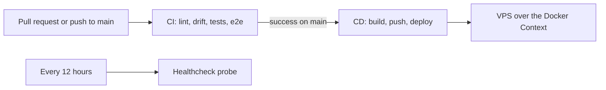

# CI/CD

This guide describes the continuous-integration jobs, the continuous-deployment phases, the merge gates, and the required secrets. It documents the current implemented state. The deploy and rollback mechanics live in the runbooks; this guide owns the pipeline view.

Canonical sources:

- CI: `.github/workflows/ci.yml`
- CD: `.github/workflows/cd.yml`
- Uptime probe: `.github/workflows/healthcheck.yml`
- Deploy script: `scripts/deploy.sh`

## Pipeline overview

CI runs on every pull request and on pushes to `main`. CD runs after CI concludes successfully on `main` (`workflow_run`), or by manual dispatch. The healthcheck workflow runs on a schedule, independent of a deploy.

## CI jobs

| Job | Gates | Notes |
|-----|-------|-------|
| `python` (matrix: `backend`, `worker`, `mcp`) | Lint, types, and tests per package | `uv sync --frozen`, then ruff, `mypy --strict`, and pytest for each package. |
| `contract` | Cross-package wire contracts | Editable-installs backend + MCP into one interpreter, then runs the schema-mirror and header-constant drift guards. |
| `frontend` | Frontend behavior | `npm ci`, then oxlint, `tsc`, vitest with the 70% coverage gate, and the production build. |
| `codegen-drift` | The frozen frontend REST client | Regenerates `frontend/openapi.json` and the TS client, then fails on a stale committed client. |
| `resume-schema-lock` | The resume document shape | Runs the golden snapshot and the append-only sha256 hash-lock guards; a shape change fails unless the version is bumped, an upcaster is registered, and a new golden is committed. |
| `deploy-config` | The deployment topology | Runs the `deploy.sh` bash test harness, shellchecks the script, parses every Compose layer, and validates the Prometheus rules (promtool) and the Alertmanager config (amtool), all without a live VPS. |
| `e2e` | The full spine | Brings up the E2E infra (Postgres, Redis, MinIO), then runs Playwright, which starts the app processes and a fake embedding provider. |

Route coverage is not a separate job. The route-registry coverage check runs inside the backend pytest suite.

## Merge gates

A change to `main` must pass every CI job. The gates that most often block a merge:

- Coverage floors: backend, worker, and MCP 80%; frontend 70%.
- `codegen-drift`: the committed `frontend/openapi.json` and `frontend/src/api/schema.d.ts` must match the external app. Run `just codegen` and commit the result.
- `contract`: the MCP wire constants and the backend-to-MCP schema mirror must match. Change both sides together.
- `resume-schema-lock`: a resume shape change must bump the version, register an upcaster, and commit a new golden.

## CD phases

CD deploys the whole stack to the single VPS over an SSH Docker Context. The Compose CLI runs in the runner; the engine runs on the box. `DEPLOY_SHA` is the exact commit CI validated (or the dispatched HEAD), used for both the image tag and the recorded rollback SHA.

| Job | Action |
|-----|--------|
| `discover` | Parse the deployable Compose file with the official parser and emit a build matrix of the first-party images (`ghcr.io/<owner>/floresu/*`), auto-derived so a new service is picked up without editing the workflow. |
| `build-and-push` | Build each first-party image with Buildx and push two tags to GHCR: `:latest` (what deploy pulls) and `:sha-<DEPLOY_SHA>` (immutable, what a rollback re-pulls). The frontend build receives the prod public URLs as build args. |
| `deploy` | Register the Docker Context, render and read every config and secret CLI-side, then run `scripts/deploy.sh`. On failure a conditional step owns the rollback. |

`scripts/deploy.sh` runs a fixed sequence: assert every required config and secret env var is set, pull images, run migrations pre-traffic (`alembic upgrade head`, aborting on failure), start the stack under the `tunnels` profile with `--force-recreate`, health-gate every service for about 60 seconds, then record the deployed SHA on success. See `docs/runbooks/deploy.md` and `docs/runbooks/rollback.md`.

The first-party images build from their own contexts declared in `docker-compose.yml`; `discover` parses the context and dockerfile from `docker compose config`.

## Required secrets

CD reads these from GitHub Actions repo secrets. It exports them into the deploy step, and Compose transmits them to the daemon as environment-sourced configs and secrets; nothing is written to the box.

| Secret | Contents |
|--------|----------|
| `DEPLOY_SSH_KEY` | The deploy user's private SSH key |
| `DEPLOY_SERVER_IP` | The VPS public IP |
| `POSTGRES_PASSWORD` | The Postgres password |
| `REDIS_PASSWORD` | The Redis password |
| `SESSION_JWT_SECRET` | The HS256 human-session secret (at least 32 bytes) |
| `INTERNAL_API_TOKEN` | The shared secret for the internal boundary |
| `DISCORD_WEBHOOK_URL` | The webhook for alerts (Alertmanager exits on a blank webhook) |
| `GF_SECURITY_ADMIN_PASSWORD` | The Grafana admin password |
| `OPENAI_API_KEY` | The embedding provider key |
| `FLORESU_OAUTH_PRIVATE_KEY` | The OAuth AS signing PEM (raw) |
| `FLORESU_CLOUDFLARED_CREDENTIALS` | The tunnel credentials JSON (raw) |
| `R2_ACCESS_KEY_ID`, `R2_SECRET_ACCESS_KEY` | The R2 object-store credentials |

`GITHUB_TOKEN` is the built-in Actions token; CD uses it to push images to GHCR (the workflow requests `packages: write`). The non-secret half of the config (`.env.prod`, R2 endpoint and bucket, the tunnel id and hostnames) is committed. See `docs/runbooks/bring-up.md` for the one-time steps that produce these values.

## Healthcheck workflow

`healthcheck.yml` runs every 12 hours from GitHub's public runners. It probes three public, unauthenticated surfaces for HTTP 200, retrying up to three times each:

- `https://floresu.com/` (the SPA)
- `https://api.floresu.com/.well-known/oauth-authorization-server` (AS metadata)
- `https://mcp.floresu.com/.well-known/oauth-protected-resource` (MCP PRM)

It catches failures internal scraping cannot see: DNS, the Cloudflare edge, the tunnel, and per-host ingress routing. On failure after retries it posts one Discord message and fails the job. It deliberately does not probe the edge-blocked observability paths.

## Troubleshooting

| Symptom | Cause | Resolution |
|---------|-------|------------|
| `codegen-drift` fails | The committed client is stale | Run `just codegen` and commit the result |
| `contract` fails | A wire constant or schema diverged between the backend and MCP | Change both sides together; re-run the `contract/` project |
| `resume-schema-lock` fails | The resume shape changed without a version bump | Bump the version, register an upcaster, run `just resume-goldens`, and commit |
| Deploy fails the health gate after Alertmanager starts | The Discord webhook is blank or unrendered; Alertmanager exits on config load | Provide a valid `DISCORD_WEBHOOK_URL` so CI renders the config |
| Deploy aborts before any container serves traffic | A migration failed in the pre-traffic step | Fix the migration; migrations run before traffic, so a failure aborts safely |
| Rollback refuses | No previous `.deployed-sha` exists (first deploy) | Fix forward; there is no prior release to restore |

## Cross-references

- Deploy operations: `docs/runbooks/deploy.md`.
- Rollback: `docs/runbooks/rollback.md`.
- Migration strategy: `docs/runbooks/migration.md`.
- Metrics and alert routing: `docs/monitoring.md`.
- Test layers and gates: `docs/testing.md`.
