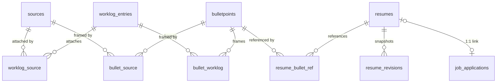

# Data model

This guide describes what Floresu stores, which domain owns each store, and how the schema evolves. It documents the current implemented state and cites canonical source paths instead of reproducing DDL.

Canonical sources:

- ORM base and naming convention: `backend/src/floresu/core/orm.py`
- Connection pool: `backend/src/floresu/core/db.py`
- Domain models: each domain's `models.py` (listed per section below)
- Migrations: `backend/alembic/versions/`
- Migration operations runbook: `runbooks/migration.md`

All persistent state lives in one PostgreSQL database (with the `vector` extension), reached by the backend over one async connection pool. The MCP server and the worker hold no store of their own; the worker reads and writes only over the internal API.

## Storage ownership

| Domain | Tables | Data owned |
|--------|--------|------------|
| accounts | `users`, `revoked_sessions` | Human accounts and the session-revocation blacklist |
| audit | `audit_log` | The append-only record of every content write; backs the feed and item history |
| oauth | `oauth_clients`, `oauth_auth_requests`, `oauth_authorization_codes`, `oauth_refresh_tokens`, `oauth_grants` | The OAuth 2.1 AS persistence |
| profile (sources) | `sources` (base) + `roles`, `projects`, `certifications`, `education` | Ground-truth career sources, as class-table inheritance |
| profile (skills) | `skills` | The curated per-user skill list |
| profile (variants) | `identity_variants` | Labeled contact sets a resume header projects |
| worklog | `worklog_entries`, `tags`, `worklog_source`, `worklog_tag` | The work timeline, its tags, and its attachment edges |
| library | `bulletpoints`, `bullet_source`, `bullet_worklog` | Canonical reusable bullets and two provenance edges |
| resumes | `resumes`, `resume_bullet_ref`, `resume_revisions`, `job_applications` | The output layer: resumes, their bullet index, revision history, and applications |
| embedding | `embeddings` | One semantic vector per corpus item (pgvector) |

## Accounts

Two tables (`accounts/models.py`).

- `users`: `id` (a server-minted bigint identity), a unique normalized `email`, the bcrypt `password_hash`, and `has_completed_onboarding`. The password is stored only as a hash.
- `revoked_sessions`: the `sid` blacklist. Each row revokes one session id (the `sid` shared by an access and refresh pair); presence means revoked. `expires_at` lets a later cleanup drop rows once the refresh token would have expired anyway.

See `auth.md` for the session model that uses this blacklist. The content domains (sources, worklog, library, resumes, skills, identity variants, embeddings, audit) carry a bigint `user_id` foreign key to `users.id` with `ON DELETE CASCADE`, so deleting an account removes its data. The OAuth tables store the resolved identity as a string with no hard foreign key, and the accounts repository maps it to the bigint `users.id`.

## Audit log

One table, `audit_log` (`audit/models.py`), append-only. One row per content write.

- `id` is a server-minted monotonic bigint identity that doubles as the SSE event id and the feed ordering key.
- `actor_type` is the native `actor_type` enum (`human` / `agent`); `actor_label` names the agent and is null for a human, who renders as "you".
- The record is an `action` plus an optional `summary` and light `metadata`. No field-level diff is stored.
- The composite index `(user_id, id)` serves the per-user, newest-first feed and item-history reads (scanned backward for `ORDER BY id DESC`).

See `api.md` for the feed endpoints and `auth.md` for the actor model.

## OAuth

Five tables back the OAuth 2.1 AS (`oauth/models.py`). There is no OAuth-specific audit table: agent-grant provenance flows through the shared `audit_log`, and issuance is observed via structured logs plus the `oauth_tokens_issued_total` metric.

| Table | Purpose | Key notes |
|-------|---------|-----------|
| `oauth_clients` | Dynamic Client Registration records | Public clients (PKCE, no secret); `redirect_uris`, `grant_types`, `response_types` as JSONB |
| `oauth_auth_requests` | Parked `/authorize` requests | Addressed by an opaque id, short-lived; holds the PKCE challenge, scope, state, resource |
| `oauth_authorization_codes` | One-time codes minted at consent | PKCE-bound; `used` flips true on first exchange so a replay is detectable |
| `oauth_refresh_tokens` | Rotating refresh tokens | Stored as `token_hash` (PK); `revoked` gates reuse; `grant_id` indexed for chain revoke |
| `oauth_grants` | The connected-client relationship | Unique `(user_id, client_id)`; `authorized_at` and `last_active_at`; `revoked_at` nullable |

See `auth.md` for the token lifecycle and the stale-client reaper.

## Sources (class-table inheritance)

The profile domain models ground-truth career sources as class-table inheritance (`profile/models.py`).

- `sources` is the base supertable: the common columns every source shares (`display_label`, `date_start`, `date_end`, `summary`, `sort_order`, `archived_at`) plus the `kind` discriminator (native `source_kind` enum: `role` / `project` / `certification` / `education`).
- `sources` carries a `UNIQUE (id, kind)`, so each subtype binds `kind` in a composite foreign key. A per-subtype `CHECK` pins the value, and the composite FK enforces it, so a subtype row can never disagree with which subtype it is.
- One subtype table per kind holds only that kind's columns: `roles` (company, job title, aliases, location), `projects` (links), `certifications` (issuer, credential id), `education` (institution, degree, field).
- A list read that needs common fields hits `sources` alone; a typed-detail read joins the one subtype table.
- `sources` is the single polymorphic FK target that worklog entries and bullets attach to.

## Skills and identity variants

Two flat per-user tables (`profile/skills/models.py`, `profile/variants/models.py`).

- `skills`: a `name` (unique per user), a `sort_order`, and a soft `archived_at`. There is no stored usage count: a skill's usage is derived on read from tag matches, and a skill is not embeddable.
- `identity_variants`: a `label` (unique per user), a display `full_name`, a `contact` JSONB object, a `links` JSONB array, an `is_default` flag, and a soft `archived_at`. Exactly one default per user is enforced in the service (it flips the previous default off in the same transaction), not by a database constraint.

## Worklog

Four tables (`worklog/models.py`).

- `worklog_entries`: the ground-truth timeline row: a `title`, an `entry_date`, an optional `description`, a `content_hash` over the embeddable text that gates re-embedding, and a soft `archived_at`.
- `tags`: a per-user free-text label, `UNIQUE (user_id, label)`, so a reuse resolves to the existing row. Tag color is not stored; it is derived deterministically from the label.
- `worklog_source` and `worklog_tag`: pure many-to-many edge tables (composite primary key, no surrogate id) that cascade on either endpoint's delete.

## Library and the provenance DAG

Three tables (`library/models.py`).

- `bulletpoints`: the canonical, reusable framing row: a `text`, a `content_hash` that gates re-embedding, an optimistic `revision` token guarded by `If-Match`, and a soft `archived_at`. Only canonical bullets live here; a resume-local copy-on-write fork lives inline in the resume document, which keeps outputs out of the searchable corpus.
- `bullet_source` and `bullet_worklog`: the two provenance edges. Together with `worklog_source` (owned by the worklog domain) they are the three joins of the provenance DAG: a bullet frames a source directly or frames a worklog entry, and a worklog entry attaches to a source.

## Resumes (JSONB-authoritative, write-derived)

Four tables (`resumes/models.py`).

- `resumes`: the output layer's authoritative row. The full content lives in `document` (JSONB). A few scalar columns are re-derived on every write by the single service writer, so they cannot drift: `title`, `schema_version`, and the optimistic `revision` token. `kind` (`living` / `application`) is chosen at creation; `status` is `draft` for a living resume and moves to `finalized` only for an application resume. `forked_from_resume_id` records fork provenance. `job_application_id` is the single unique 1:1 link an application resume carries, and a `CHECK` forbids a living resume from linking one.
- `resume_bullet_ref`: write-derived. The service reindexes it on every save to exactly the canonical bullets the live document references, so "used in N" is a cheap count.
- `resume_revisions`: append-only (keep-all). Every save stores a fully resolved snapshot (references resolved to inline text at that moment) so a later library edit can never rewrite the past. Each revision may carry a `pdf_object_key` for its stored PDF.
- `job_applications`: a lightweight relational entity whose `submitted` status is the finalize trigger.

Resume `revision` is the optimistic-concurrency token clients guard with `If-Match`. See `api.md` for the copy-on-write item flow and the concurrency contract.

## Vector index

One table, `embeddings` (`embedding/models.py`).

- Keyed by a polymorphic `(item_kind, item_id)` with no foreign key to the item, so a new embeddable kind needs no schema change. The three embeddable kinds are `worklog`, `bullet`, and `source`; outputs (resume documents) are never embedded.
- `content_hash` mirrors the source row's hash at embed time; the pipeline compares it to gate re-embedding. `model` records the provider. The `vector` column is pinned to 1536 dimensions (`text-embedding-3-small`), both here and at migration time.
- An HNSW cosine ANN index (`ix_embeddings_vector_hnsw`) backs the semantic ranking; per-corpus full-text GIN indexes on the sibling tables back the lexical ranking. See `api.md` for hybrid search.

## Migration strategy

Migrations use Alembic (`backend/alembic/`). The revision chain is linear: `0001_baseline` (creates the `vector` extension), `0002_users`, `0003_accounts_sessions`, `0004_audit_log`, `0005_oauth`, `0006_sources`, `0007_worklog`, `0008_library`, `0009_skills_identity_variants`, `0010_resumes`, `0011_embeddings` (the `embeddings` table, its HNSW index, and the corpus full-text GIN indexes on the sibling tables).

- Every domain's ORM models inherit from one `Base` (`core/orm.py`), so `Base.metadata` is the single schema Alembic diffs for `--autogenerate`.
- The ORM sets a constraint naming convention, so constraint names are deterministic and stable. Keep the convention; changing it destabilizes diffs.
- Native enums (`source_kind`, `resume_kind`, `resume_status`, `job_application_status`, `actor_type`, `embed_item_kind`) are created explicitly in their migration with `create_type=False`, so a table create or autogenerate never re-emits `CREATE TYPE`.
- Migrations run pre-traffic, never at app startup. Keep every normal migration additive (expand or contract) so an image-only rollback stays safe.
- Run migrations with `just migrate`. See `runbooks/migration.md` for operations.

## Cross-component references

- The provenance edges use hard cross-table foreign keys with `ON DELETE CASCADE` on either endpoint: `worklog_source` binds a worklog entry to a source, `bullet_source` and `bullet_worklog` bind a bullet to a source or a worklog entry, and `resume_bullet_ref` binds a resume to a canonical bullet. A hard delete of an endpoint removes only its edges.
- The `embeddings` table deliberately omits a foreign key to the item it embeds (a polymorphic `(item_kind, item_id)` key), so a new embeddable kind needs no schema change and a permanent delete must explicitly purge the vector.
- The OAuth tables key rows to the identity as a string with no hard foreign key.
- The service layer enforces the derived cross-domain rules, not the database. For example, the "used in N" count behind the copy-on-write scope rule is a service-layer query over `resume_bullet_ref`.

## Cross-references

- Session and OAuth token models: `docs/auth.md`.
- REST route catalog and the copy-on-write item flow: `docs/api.md`.
- Embedding pipeline and hybrid search: `docs/api.md`, `docs/monitoring.md`.
- System topology and trust zones: `docs/architecture.md`.
