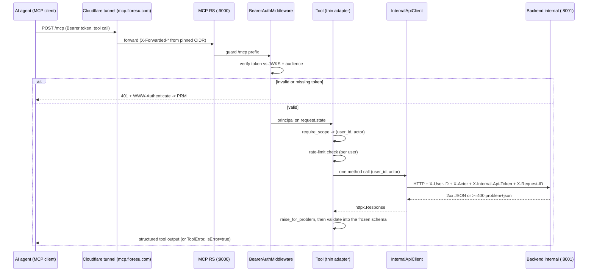

# MCP server

The MCP server is Floresu's AI-agent front door. It exposes the user's career history (profile, worklog, library, resumes, job applications, and search) over the Model Context Protocol so an agent can read and record it. It is a separate deployable image (`floresu-mcp`) and an OAuth 2.1 Resource Server (RS).

The server is a thin dispatcher. It holds no domain logic and imports no backend domain code. Each tool body is one authenticated call to the backend internal app (`:8001`), so the rules live in one place (the shared service layer). The wire truths it shares with the backend (header names, the single scope, schema shapes) are re-declared here and kept in sync by contract tests, not by import.

Canonical sources: `mcp/src/floresu_mcp/`. This doc cites the module for each claim.

## Transport

Canonical source: `mcp_server.py` (server factory), `app.py` (RS assembly), `main.py` (entrypoint).

- Framework: `FastMCP` from `mcp.server.fastmcp`. The framework owns tool execution, schema generation, and the Streamable HTTP protocol.
- Transport: Streamable HTTP, stateless, JSON responses (`stateless_http=True`, `json_response=True`). Each tool call is one authenticated `POST`. No per-agent session is pinned. This is the recommended production mode.
- Process: `main.py` builds the app with `build_app` and runs uvicorn on `:9000`. The tunnel reaches it at `mcp.floresu.com`.

### The two explicit transport routes

`app.py` binds two explicit full-match routes, `POST /mcp` and `POST /mcp/`, to the bare ASGI transport (`StreamableHTTPASGIApp`). It does not use a `Mount`.

Warning: a `Mount` only partial-matches `/mcp`, so Starlette's `redirect_slashes` emits a 307 from `/mcp` to `/mcp/`. That 307 stalls https-to-http MCP clients for about 30 seconds. Keep the two explicit routes.

`app.py` calls `mcp.streamable_http_app()` once during assembly. That call has a side effect: it creates the session manager. The `session_manager` property raises without it. The returned sub-app is intentionally not mounted.

### DNS-rebinding protection

`_transport_security` in `mcp_server.py` sets the policy:

- Development: protection is disabled, so the local MCP Inspector can attach over localhost.
- Production: protection is enabled and scoped to the pinned resource host. This is defense in depth behind the tunnel and the bearer boundary.

## Middleware order

`create_rs_app` adds middleware so the effective outermost layer runs first. The verified order, outermost first:

| Order | Middleware | Scope | Purpose |
|-------|------------|-------|---------|
| 1 (outermost) | `ProxyHeadersMiddleware` | Production only | Trust `X-Forwarded-*` from the pinned app-net CIDR. Rewrite the tunnel's plaintext scheme to https. |
| 2 | `CORSMiddleware` | Development only | Serve the browser MCP Inspector's OAuth discovery and token-exchange fetches. |
| 3 | `CorrelationMiddleware` | Always on | Bind a fresh `request_id`. Correlate the non-guarded paths too. |
| 4 | HTTP metrics (`instrument`) | Always on | Count requests, including the boundary's 401s. |
| 5 (innermost) | `BearerAuthMiddleware` | Guards the `/mcp` prefix | The agent trust boundary. |

The dev-only and prod-only layers are mutually exclusive by environment. CORS is mounted only when `allowed_cors_origins` is non-empty (development). Proxy headers are mounted only when `trusted_proxies` is non-empty (production).

## The bearer boundary

Canonical source: `auth.py`, with `scopes.py`, `tokens.py`, `state.py`.

`BearerAuthMiddleware` is the RS security perimeter. It guards the `/mcp` path prefix at the boundary, not per route, so a tool route under the prefix cannot forget to authenticate.

- Every request under `/mcp` must carry `Authorization: Bearer <token>`.
- The verifier checks the token against the AS public JWKS and binds it to this RS's audience (`resource`).
- A missing or invalid token returns `401` with a `WWW-Authenticate` header that points at the PRM document, so the client can discover the AS.
- On success the middleware stashes the resolved principal on `request.state`, never the raw token, and binds `user_id` into the correlation context.

`require_scope` (in `scopes.py`) is the only way a tool obtains its `user_id` and `actor`. It fuses identity resolution with the scope check, so a tool cannot skip authorization. `user_id` is the token `sub`; `actor` is the granted `client_id` (the named-agent label the internal client forwards as `X-Actor`). A missing scope raises a model-recoverable `ToolError` (`insufficient_scope`) that names the missing scope. A tool reached without the guard fails closed (`unauthenticated`).

The RS verifies tokens but mints none. The backend external app (`:8000`) is the OAuth 2.1 Authorization Server. See `auth.md` for the token model: audience binding, `kid` rotation, and the discovery chain.

## The scope model

Canonical source: `config.py`, advertised in the PRM (`prm.py`).

Floresu grants a single full read-write scope, `floresu:full`. Consent presents exactly one access level, so there is no partial-scope state. Every tool requires this one value. `SCOPE_FULL` must equal the backend AS's `SCOPE_FULL`; a contract test (`contract/tests/`) pins the two equal, so a client sees a consistent set on both discovery documents.

## Tool catalog

Every tool is a thin adapter: it resolves `(user_id, actor)` from the validated bearer via `require_scope`, checks the per-token rate limit, makes one internal call, and validates the response into a lean, frozen projection. Every tool registers through `counted_tool_registrar` (`tool_registry.py`), which wraps it in the `mcp_tool_invocations_total` counter without changing its FastMCP schema. The read tools compose through `register_read_tools` (`tools_read.py`) and the writes through `register_write_tools` (`tools_write.py`).

The catalog is organized by family. Enumerate the exact tool names from the module at read time; the names below are current.

| Family | Read module | Write module | Tools |
|--------|-------------|--------------|-------|
| Profile (sources, skills, identity variants) | `tools_profile.py` | `tools_profile_write.py` | `profile_list`, `profile_get`, `profile_create`, `profile_update`, `profile_archive`, `profile_reorder` |
| Worklog | `tools_worklog.py` | `tools_worklog_write.py` | `worklog_query`, `worklog_get`, `list_tags`, `worklog_create`, `worklog_update`, `worklog_archive`, `worklog_tag` |
| Library | `tools_library.py` | `tools_library_write.py` | `bullet_list`, `bullet_get`, `bullet_create`, `bullet_update`, `bullet_archive`, `bullet_promote` |
| Resumes and rendering | `tools_resume.py` | `tools_resume_write.py` | `resume_list`, `resume_get`, `list_templates`, `resume_create`, `resume_update`, `resume_item_add`, `resume_item_remove`, `resume_item_reorder`, `resume_finalize`, `resume_render` |
| Job applications | `tools_jobapp.py` | `tools_jobapp.py` | `jobapp_list`, `jobapp_get`, `jobapp_create`, `jobapp_update` |
| Search | `tools_search.py` | | `search_experience` |

Notes on the shape:

- The profile family is parameterized by a `ProfileKind` argument that spans the four source kinds (`role`, `project`, `certification`, `education`), plus `skill` and `identity_variant`. `_dispatch_list` / `_dispatch_get` are the one place that maps a kind to its backend endpoint, so skills and identity variants have no separate tool family.
- The write tools that mutate a revision-guarded resume carry the caller's expected revision as an `If-Match` header. `bullet_update` (the copy-on-write scope edit) carries its guarding revisions in the body, and requires an explicit `scope` (the agent must state intent).
- There is no destructive tool. Hard delete, account export, and account deletion are web-only, so the internal app the RS calls does not mount them.

## The internal-hop boundary contract

Canonical source: `client.py`, `config.py`, `tool_errors.py`. This is the second hop: the RS to the backend internal app.

### Boundary headers

The RS sends these headers to the backend internal app. Canonical source: `config.py` (`USER_ID_HEADER`, `ACTOR_HEADER`, `INTERNAL_API_TOKEN_HEADER`) and `client.py` (`REQUEST_ID_HEADER`).

| Header | Purpose |
|--------|---------|
| `X-User-ID` | The resolved user identity (the token `sub`). The internal app trusts it only behind a valid token. |
| `X-Actor` | The named agent (the token `client_id`), recorded in the audit log and the feed. |
| `X-Internal-Api-Token` | The shared secret. The primary boundary on `:8001`, which is not tunnel-routed. |
| `X-Request-ID` | The correlation id, so the backend logs share the same id. |
| `If-Match` | The target revision for optimistic concurrency on the revision-guarded resume mutations. |

Invariants of the hop:

- The agent bearer token is never forwarded. Only the resolved `user_id` and `actor` cross the boundary. This is the confused-deputy defense.
- `client._request` copies `extra_headers` first, then sets the trusted headers (`X-User-ID`, `X-Actor`, `X-Internal-Api-Token`) last, so a caller cannot override the trusted identity.
- The internal client timeout is bounded at 10 seconds, so a hung backend call cannot pin an MCP worker.

### Client method to endpoint map

`InternalApiClient` (`client.py`) exposes one method per tool call, and the method names mirror the internal routes op-for-op. The endpoints are cataloged in `api.md`. Preserve the 1:1 shape when you add a tool.

### Error translation

Canonical source: `tool_errors.py`. The error contract itself has one canonical home: `api.md`.

- A backend response of `>=400` carries an RFC 9457 `application/problem+json` body. `raise_for_problem` folds it into one model-recoverable `BackendToolError` that names the `code`, the `detail`, and any `fields` or `violations`, so the agent can self-correct. The error carries the HTTP status and problem code for structured logging.
- A transport failure (backend unreachable or timed out) becomes a model-recoverable `ToolError` (`backend_unavailable: ... retry shortly`).
- A `>=400` response is not a transport failure. It passes through untouched so `raise_for_problem` can map it.

## Rate limiting

Canonical source: `ratelimit.py`. A runaway agent is the one real abuse vector at this scale. The limiter caps it with two per-user fixed-window budgets, keyed on the token `sub`:

- a request budget every tool call counts against (`RATE_LIMIT_REQUEST_BUDGET`);
- a tighter embed-write budget that only content-writing tools count against (`RATE_LIMIT_EMBED_WRITE_BUDGET`), since that is the embedding-cost path.

The counters live in Redis (reached over app-net; Redis is dual-homed). A trip raises a model-recoverable `ToolError` telling the agent to slow down and retry after the window resets.

## Token verification

Canonical source: `tokens.py`, `keys.py`. The `AgentTokenVerifier` checks the RS256 access token against the AS JWKS (discovered from the pinned issuer via `RemoteKeyProvider`), binds it to the pinned `resource` audience, and returns a `VerifiedAgentToken` carrying `sub`, `client_id`, and `scope`. `jwks_readiness_check` gates `/readyz` on the JWKS being reachable.

## RS-served endpoints

Canonical source: `app.py`, `prm.py`, `health.py`, `metrics.py`.

| Endpoint | Purpose | Exposure |
|----------|---------|----------|
| `POST /mcp` and `POST /mcp/` | The MCP transport, behind the bearer guard | Public at the tunnel ingress |
| `GET /.well-known/oauth-protected-resource` | The PRM document (RFC 9728), built from pinned config | Public at the tunnel ingress |
| `GET /.well-known/oauth-protected-resource/mcp` | The same PRM document, path-suffixed for discovery | Public at the tunnel ingress |
| `GET /healthz` | Liveness. Always 200 | In-network on `:9000` only |
| `GET /readyz` | Readiness. 503 if any check fails. Runs `jwks_readiness_check` | In-network on `:9000` only |
| `GET /metrics` | Prometheus. The private HTTP registry plus `TOOL_METRICS_REGISTRY` | In-network on `:9000` only |

Warning: the tunnel ingress (`mcp.floresu.com`) exposes only the PRM document and the `/mcp` transport. It returns 404 for everything else. Scrape `/metrics` and poll health in-network on `:9000`.

## Metrics

Canonical source: `tool_metrics.py`; full detail in `monitoring.md`. The RS emits `mcp_tool_invocations_total{tool,outcome}` on a dedicated `TOOL_METRICS_REGISTRY`, plus the shared `http_requests_total` / `http_request_duration_seconds` families on its private registry. `/metrics` serves both registries concatenated.

## Cross-references

- Token model, audience binding, and discovery: `docs/auth.md`.
- REST route catalog and the error contract: `docs/api.md`.
- The internal boundary and the actor model: `docs/auth.md`.
- Metrics, alerts, and retention: `docs/monitoring.md`.
- The system topology and trust zones: `docs/architecture.md`.
