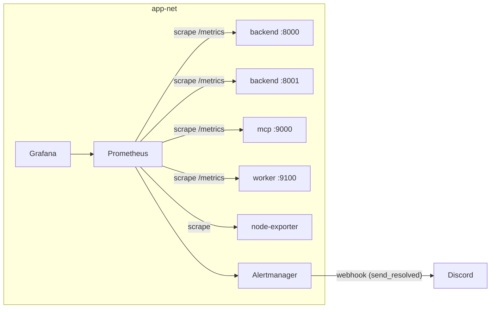

# Monitoring

Floresu's observability: what is measured, what alerts, and how long data is kept. Prometheus scrapes every first-party app and the worker in-network. Alertmanager routes to a single Discord webhook. Grafana is provisioned with an overview dashboard but is never a release gate.

Canonical sources:

- HTTP instrumentation: `backend/src/floresu/core/metrics.py`, `mcp/src/floresu_mcp/metrics.py`
- Domain/service/pool families: `backend/src/floresu/core/observability.py`
- MCP tool counter: `mcp/src/floresu_mcp/tool_metrics.py`
- Worker families: `worker/src/floresu_worker/metrics.py`
- Scrape + alert rules: `deployments/prometheus/prometheus.yml`, `deployments/prometheus/alerts.yml`
- Alert routing: `deployments/alertmanager/alertmanager.yml`
- Grafana provisioning: `deployments/grafana/`
- Container topology, retention flags, and network placement: `docker-compose.yml`

## Metrics

The backend, the MCP server, and the worker each expose `GET /metrics`. Each app concatenates its private HTTP registry with its own custom-metrics registry, so a single scrape sees the whole picture and the external and internal apps can run in one process without duplicate-timeseries errors. `/metrics` stays private via the Cloudflare ingress allow-list (which refuses it at the edge), not network isolation. The **App** column says which image emits each family.

| Metric | App | Type | Labels | Emitted by |
|--------|-----|------|--------|-----------|
| `http_requests_total` | backend + mcp | counter | `method`, `path`, `status` | Every HTTP request (`path` = matched route template, e.g. `/resumes/{id}`, to bound cardinality) |
| `http_request_duration_seconds` | backend + mcp | histogram | `method`, `path` | Every HTTP request |
| `service_method_failures_total` | backend | counter | `service`, `method` | A public service method exiting with an **unexpected** error (see below) |
| `oauth_tokens_issued_total` | backend | counter | `grant_type` | OAuth token issuance by the AS (`authorization_code` = first issuance, `refresh_token` = rotation) |
| `db_query_duration_seconds` | backend | histogram | `query_name` | Every SQL statement (via SQLAlchemy engine events) |
| `active_connections` | backend | gauge | none | Connections checked out of the SQLAlchemy pool |
| `mcp_tool_invocations_total` | mcp | counter | `tool`, `outcome` | Every MCP tool call (`outcome` = `ok`/`error`) |
| `embed_jobs_completed_total` | worker | counter | `status` | Every finished embed/purge job, by outcome (`applied`/`superseded`/`idempotent`/`archived`/`missing`/`purged`/`failed`) |
| `embed_queue_depth` | worker | gauge | none | The embed queue depth, sampled after each job |

### Service-method failures: what counts

`service_method_failures_total` counts only faults that would surface as **5xx**. Classification is by HTTP status over the `ExpectedError` base: an `ExpectedError` with `status < 500` is an expected result and is deliberately **not** counted, while one with `status >= 500` and any other exception is. So the model-recoverable 4xx domain outcomes (`NotFound`, `Conflict`, `Validation`, `Unauthorized`) are excluded, which keeps this metric correlated with the `HighErrorRate` alert rather than diluted by normal 404s and 409s. Instrumentation is a class decorator (`track_failures`); each public service method is counted once and its one `service_method_failed` error log fires behind the same predicate, so the count and the log cannot diverge.

**Asymmetry with the MCP counter.** `mcp_tool_invocations_total{outcome="error"}` counts a model-recoverable 4xx (a backend error surfaced to the agent as a `ToolError`), whereas `service_method_failures_total` excludes `FloresuError` 4xx. This is intentional: the MCP counter reports per-tool call outcomes; the backend counter reports operational faults. Do not compare their error counts directly.

### DB `query_name`

To keep label cardinality bounded, `query_name` collapses to the SQL verb (`select`/`insert`/`update`/`delete`, else `other`). A repository may override it for a specific statement via SQLAlchemy `execution_options(query_name=...)`.

## Alerts

Prometheus evaluates three critical rules and four warning rules (`deployments/prometheus/alerts.yml`) and routes them through Alertmanager to a single Discord webhook with `send_resolved: true`, so both firing and recovery are posted.

| Alert | Severity | Condition | For |
|-------|----------|-----------|-----|
| `ServiceDown` | critical | `up == 0` (any scrape target) | 1m |
| `HostDiskAlmostFull` | critical | filesystem available < 10% (non-tmpfs/overlay) | 2m |
| `HighErrorRate` | critical | 5xx ratio of `http_requests_total` > 5% over 5m | 5m |
| `SlowQueries` | warning | p95 `db_query_duration_seconds` > 1s over 5m | 5m |
| `EmbeddingJobFailureRate` | warning | failed share of `embed_jobs_completed_total` > 50% over 1h | 5m |
| `EmbeddingJobStuck` | warning | `embed_queue_depth > 0` and no completions in 10m | 10m |
| `AuthFailuresSpike` | warning | 401 rate on `/auth/login` > 0.2/s over 5m | 1m |

`node-exporter` provides the host filesystem series `HostDiskAlmostFull` reads. `EmbeddingJobFailureRate` divides by every finished job, so it is NaN when the queue is idle and never fires on an idle worker.

### Discord webhook templating (required for Alertmanager to start)

`deployments/alertmanager/alertmanager.yml` keeps a `${DISCORD_WEBHOOK_URL}` placeholder in the committed file. Alertmanager does not expand environment variables, so CI renders it (`envsubst` substitutes **only** that token) into the `FLORESU_ALERTMANAGER_CONFIG` env var, which the `alertmanager` service receives as an environment-sourced Compose secret at `/etc/alertmanager/alertmanager.yml`. The Go templating (`{{ ... }}`) in the title and message is left untouched and renders at alert time. No rendered file is written to the box; never commit a real webhook.

**This render is release-gating, not merely needed for live firing.** Alertmanager v0.27 **exits on config load** if `webhook_url` is not a valid URL (an unrendered or blank placeholder). Because the deploy health gate polls every service, a deploy that starts Alertmanager without a rendered webhook fails the gate and rolls back. To avoid crash-looping local dev, the `alertmanager` service is gated behind the `tunnels` compose profile (the only profile the deploy activates), so `just up` and `just up-dev` do not start it; Prometheus and node-exporter still run locally.

## Retention and query guards

Configured as Prometheus command flags in `docker-compose.yml`:

- Retention: `--storage.tsdb.retention.time=3d` and `--storage.tsdb.retention.size=2GB` (whichever hits first).
- Query guards: `--query.max-concurrency=5` and `--query.timeout=30s`, sized for the single-VPS scale.

TSDB persists to the `promdata` named volume.

## Grafana

Grafana ships as a first-party image (`deployments/grafana/`) with the Prometheus datasource and the `floresu-overview` dashboard baked in. It runs under the `tunnels` profile and is provisioned but non-gating: it is never a release gate, and the admin password is supplied at runtime (a GitHub secret at deploy; the stock default locally).

## Topology

Prometheus, node-exporter, Alertmanager, and Grafana run on `app-net` alongside the other first-party services; none is reachable through the tunnel because the Cloudflare ingress allow-list refuses their surfaces at the edge. The backend is scraped on both its external (`:8000`) and internal (`:8001`) apps; the MCP server on `:9000`; the worker on `:9100`, all in-network. Alertmanager and Grafana are additionally gated behind the `tunnels` profile.

## Cross-references

- The `/metrics` endpoint exposure and the error contract: `docs/api.md`.
- The MCP tool counter and rate limiting: `docs/mcp.md`.
- Alert webhook secrets and the deploy health gate: `docs/ci-cd.md`, `docs/runbooks/deploy.md`.
- System topology and network tiers: `docs/architecture.md`.
